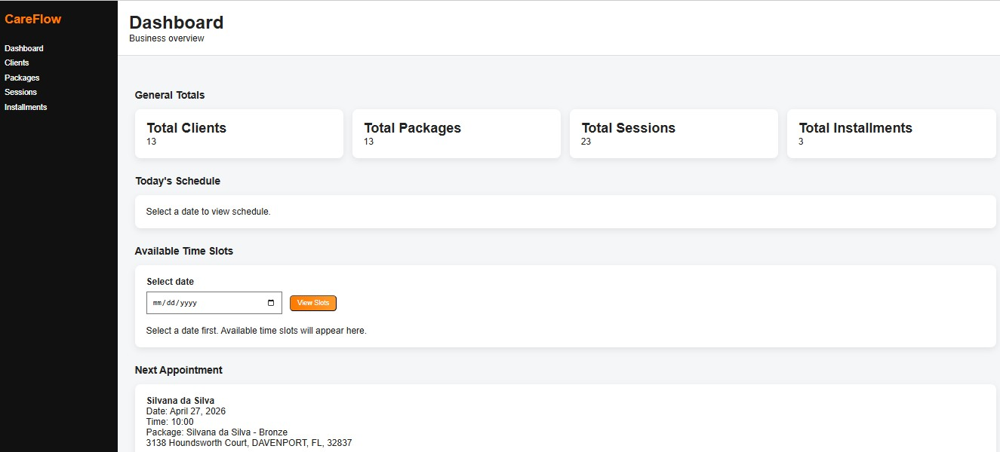

# CareFlow – Client Management & Scheduling System
Backend first Django system for managing recurring client care packages, scheduling, session tracking, installment payments, and business rule driven workflows.

## Overview
CareFlow is a web based system developed to manage client scheduling, service packages, and operational workflows.

## Problem
Many service-based businesses struggle with:
- Disorganized scheduling
- Lack of client tracking
- Inefficient workflow management

## Solution
CareFlow provides a structured system to:
- Manage clients and service packages
- Organize scheduling and sessions
- Improve operational efficiency

This system simulates real-world business operations, improving organization and reducing manual errors.

## Features
- Authentication system
- Client and session management (CRUD)
- Data validation and business rules
- Backend architecture using Django
- PostgreSQL database integration

## Tech Stack
- Python
- Django
- PostgreSQL

## Screenshots



## Security Considerations
- Sensitive data managed using environment variables
- Basic validation rules implemented
- Structured backend design with security in mind

## Status
🚧 Actively developing with focus on reliability and security
=======
# CareFlow

CareFlow is a backend-first SaaS-oriented platform for managing recurring client care packages, sessions, installment payments, and business-rule-driven workflow automation.

## Overview

This system was designed for professionals who work with recurring client services such as therapists, coaches, and consultants.

## Tech Stack

* Python
* Django
* Django REST Framework
* JWT Authentication (SimpleJWT)
* SQLite

## Features

* Client management
* Package tracking
* Session scheduling
* Installment payments
* Overdue payment validation
* Automatic session usage tracking
* REST API endpoints
* JWT authentication

## API Endpoints

* `/api/clients/`
* `/api/packages/`
* `/api/sessions/`
* `/api/installments/`
* `/api/token/`
* `/api/token/refresh/`

## How to Run

```bash
python -m venv venv
venv\Scripts\activate
pip install -r requirements.txt
python manage.py migrate
python manage.py createsuperuser
python manage.py runserver
```

## Author

Paulo Ferreira
>>>>>>> adaad9f (Setup project structure and gitignore)
